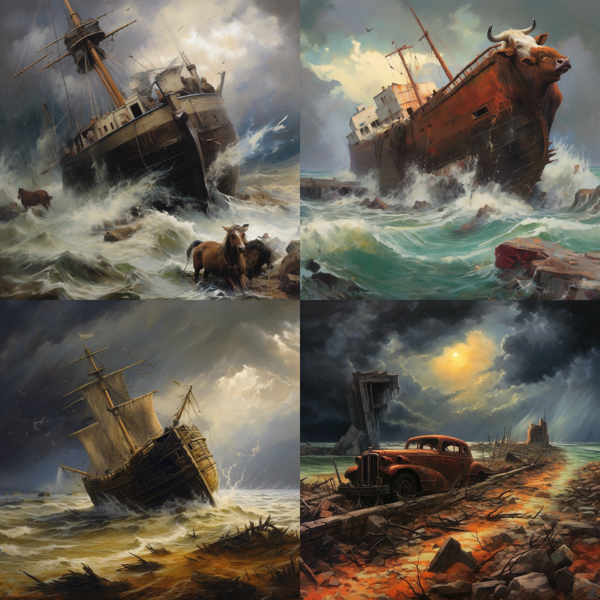

This is another prompt I ran twice. The first set were quite compelling, but I wanted to see if clicking the :arrows_counterclockwise: button would bring in more `shorn` content into the illustration. I was hopeful, because two of the first images integrated farm animals, but not sheep! I suppose it's possible that horses and cattle get shorn, admittedly I have no idea.

The second round brought the sheep I wanted to see... they seem a bit pre-shorn, but good enough for me. For posterity, here are the original generated images:

