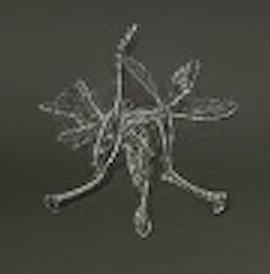
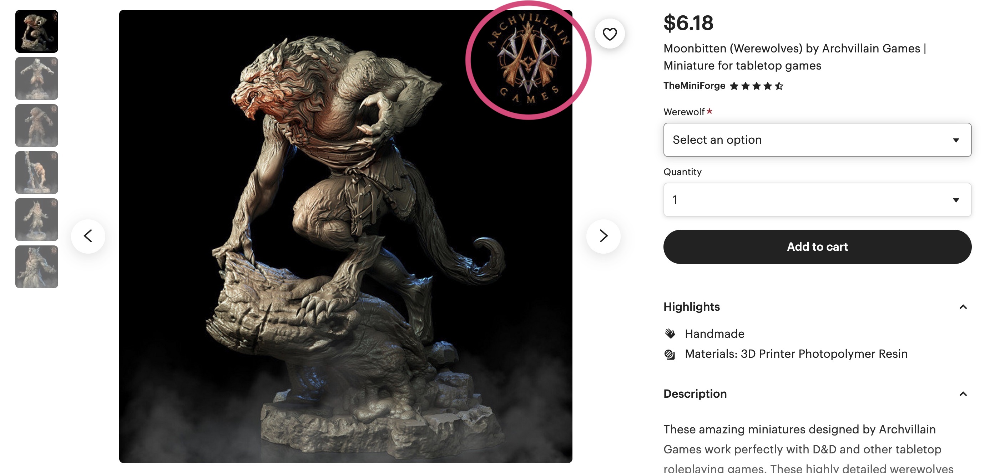

Ruh-roh!

This is the first time I've used Midjourney to generate an image with a really obvious watermark I could try to track down. I've seen them on other images as some garbled version of a signature with random letters, but this one looks like something I might recognize if I saw it again.

I popped the Midjourney-created image into Google's image search using their "lens" feature, and it hit several visual matches from an Etsy shop called [The Mini Forge](https://www.etsy.com/shop/TheMiniForge) that sells licensed 3D resin prints of miniatures designed by [Archvillain Games](https://www.myminifactory.com/users/ArchvillainGames).

That logo looks familar, doesn't it?

It's funny, if I had been paying more attention when I was solving this one, I would have never picked `RESIN`, because it repeated the letter `E` in the same place as my first guess, `FERAL`. Without `RESIN` in the mix, it's really unlikely that Midjourney would have surfaced a product like this that was fairly easy to track down.
