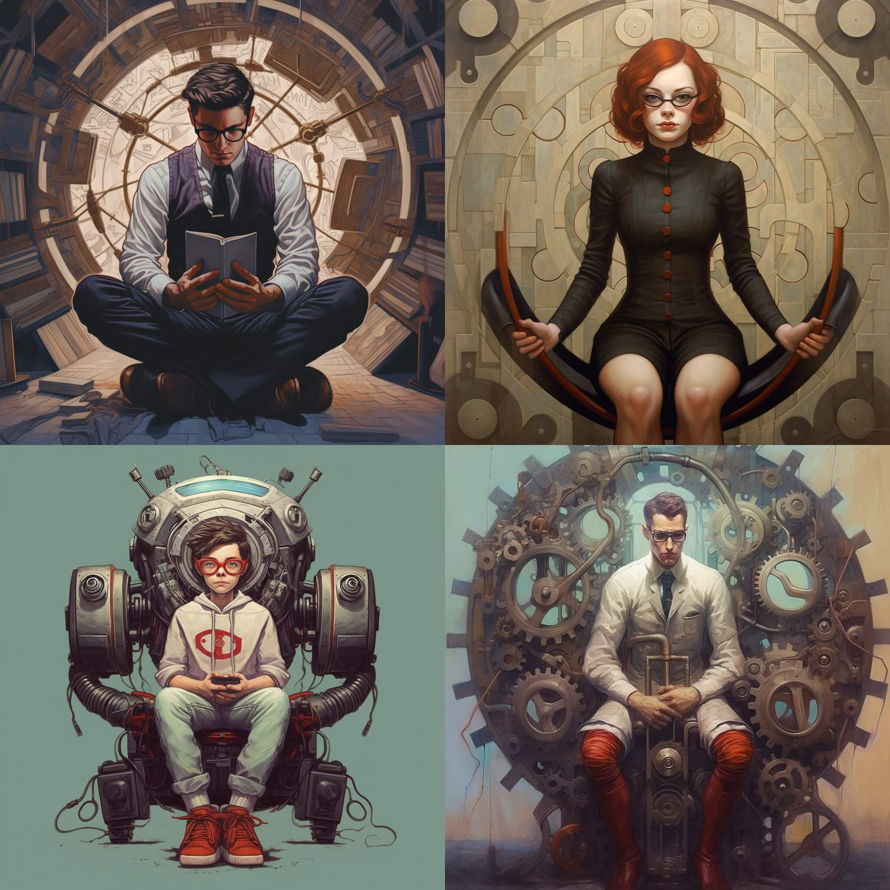

This one includes a sub-optimal guess, `GEEKY`, which repeats the `K` in the incorrect position but clued me in that there were two `E`, so it wasn't a total waste of a guess.

Some things I noticed about this prompt that caused me to re-run it several times:

- Midjourney could not figure out what legs are supposed to do when they are kneeling.
- "Geeky" seems to be highly gendered. This isn't the first time I've noticed this:
  - [#703: Clerk]() and [#700: Flask]() also returned images of men.
  - [#694: Scarf](), and [#701: Brash]() (which included `ARTSY` and `FLORA` as guesses), predominantly returned images of women, interestingly, there wasn't as strong of a connection, and I was able to pick images that were more open to interpretation.

The images devolved a bit further before I decided to see what `--niji 5` could do. As you can see above, still no concept of `KNEEL` (let's just say a crouch is close enough), nothing that screams `SPOKE`, but we have a nice `THICK` jacket, and a more non-stereotypical `GEEKY` person.

Here are a few from the original runs...

Huh. Apparently geeks don't kneel?

And, just for fun, here's what it generated with just `KNEEL`.

