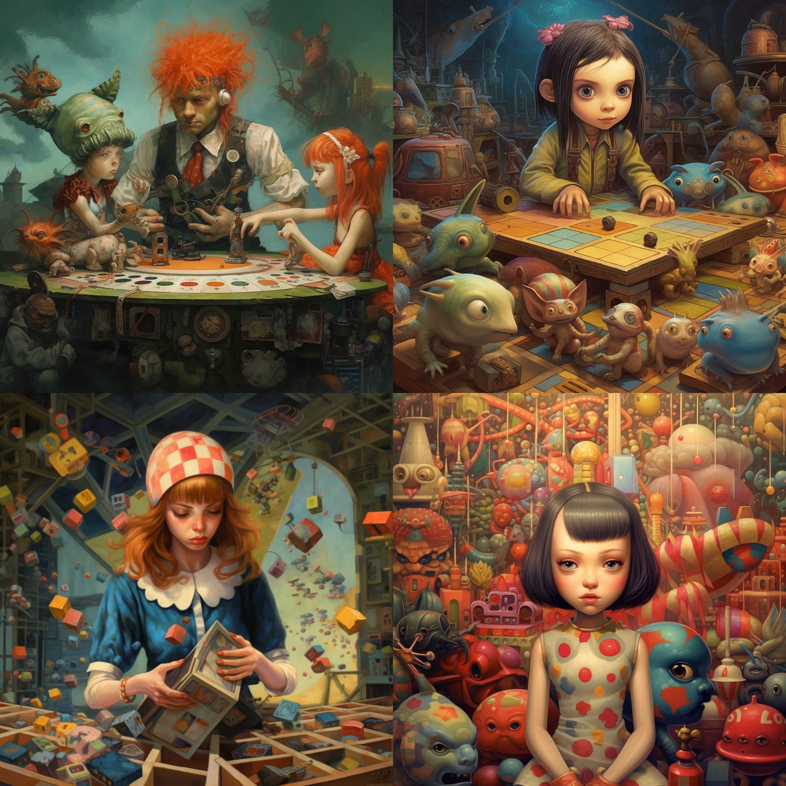

This prompt generated a lot of interesting images, so I figured I would share them as well. I picked the one above because it was visually well composed and also included a lot of my guesses, even `PLUNK`, if you can imagine the sound of the items in the background eventually succumbing to gravity and hitting the floor.

