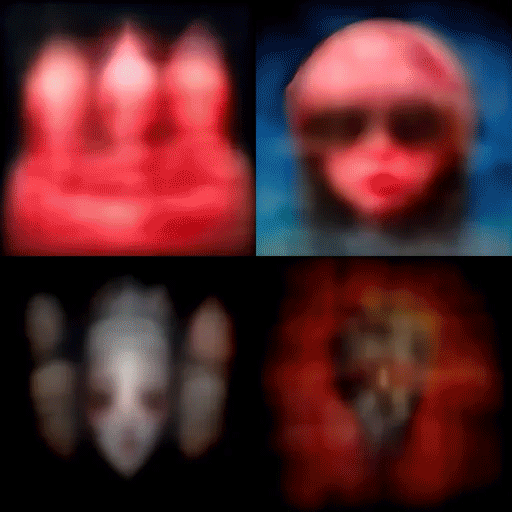

I quite liked the different variations that the model came up with for this prompt. They're all very different. I wonder if the portrait of the youth was influenced by graphics from anti-bullying campaigns? It doesn't really seem to fit the prompt, but it's a nice image.

I created a simple gif showing the rendering process for the second run on the same prompt. It's interesting to see how the angle of the face changes for the image in the top-right corner as Midjourney improves the resolution. One of these days I'll learn more about how MidJourney works.

