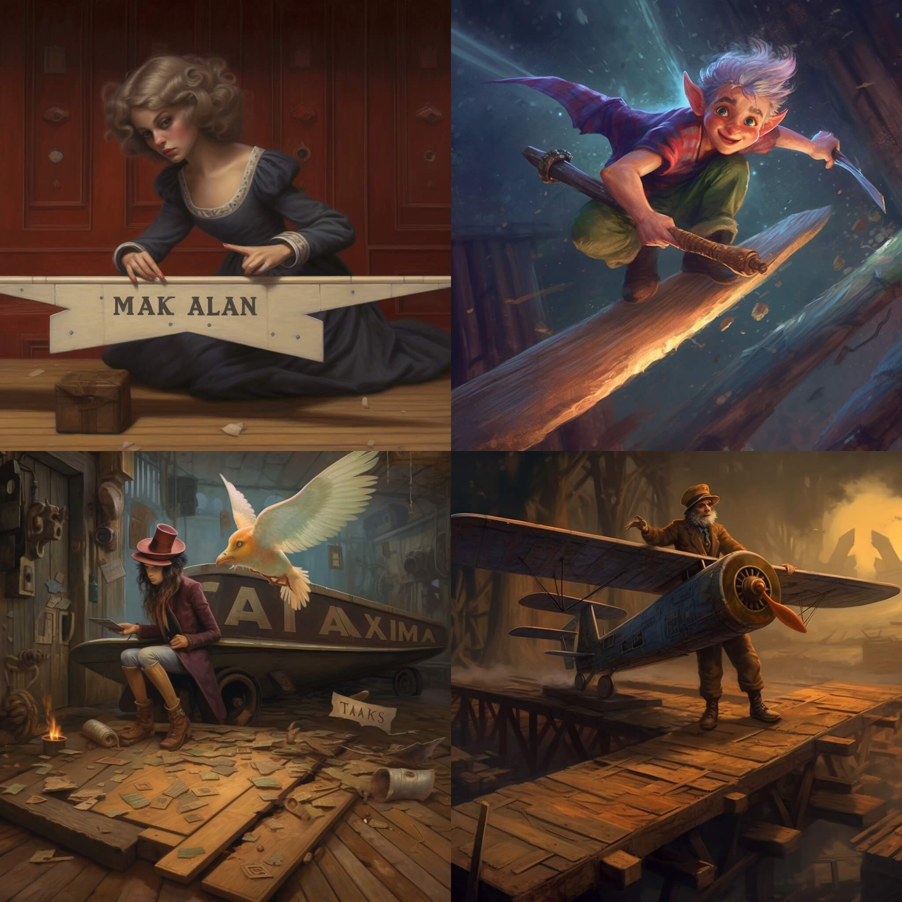

I really liked the first four interpretations of the prompt, and was curious if running the prompt again would produce another set of interesting images. I think the second run was even better than the first.

Here are all eight images that were generated:

